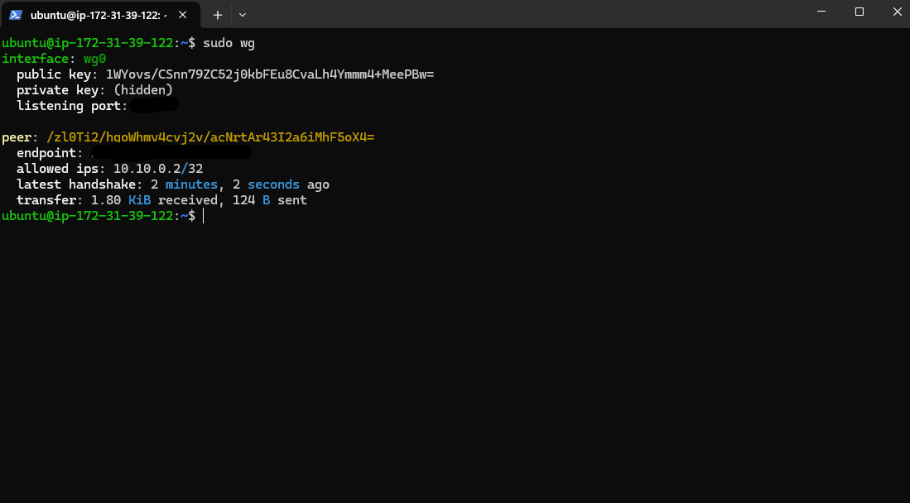
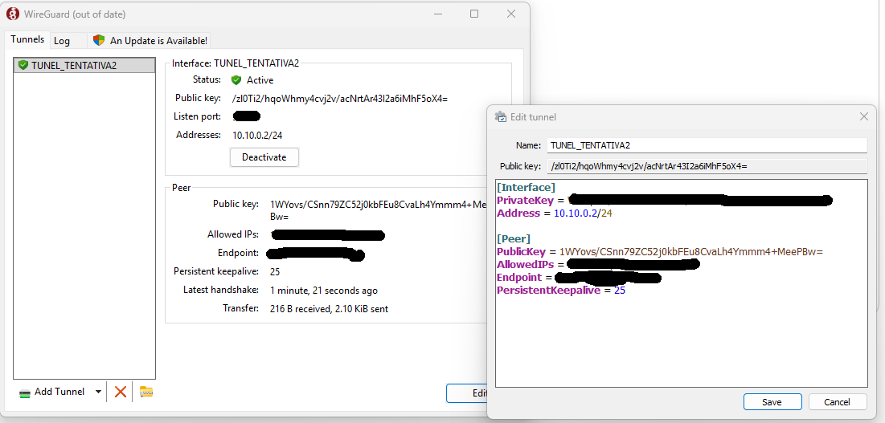
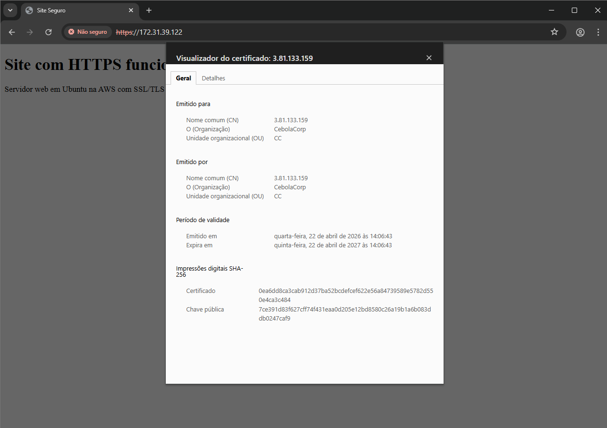
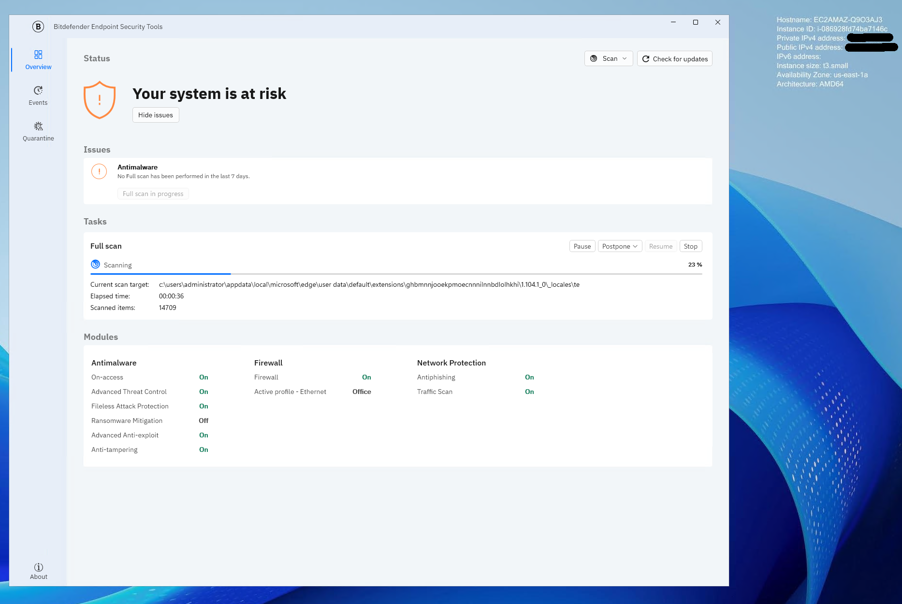
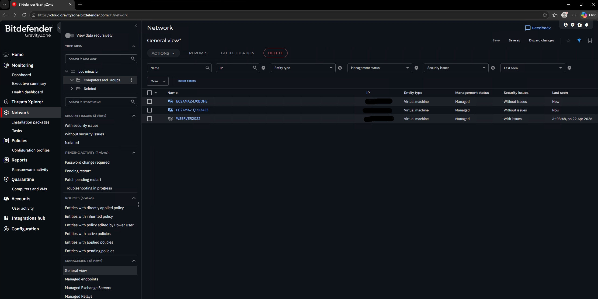

# Stage 3 — Secure Communications

Extension of the lab environment with secure communication mechanisms and endpoint protection, including VPN, HTTPS and corporate antivirus management.

---

## Objectives

- Deploy WireGuard VPN server with external endpoint connectivity
- Host an HTTPS web server with SSL/TLS certificate
- Deploy Bitdefender GravityZone in centralized management mode

---

## Architecture

```
Personal Endpoint
    │
    │ WireGuard tunnel (encrypted)
    │
Linux-Server (AWS)
    ├── WireGuard VPN server
    ├── HTTPS web server (nginx + self-signed cert)
    │
Win-Server (AWS)
    └── Bitdefender GravityZone console
            │
            └── manages agent ──► Win-Client
```

---

## Implementation

### WireGuard VPN

WireGuard installed on Linux-Server as VPN server. Personal machine configured as client endpoint, establishing an encrypted tunnel to the AWS instance.

```bash
# Install WireGuard
sudo apt install wireguard -y

# Generate server keys
wg genkey | tee /etc/wireguard/privatekey | wg pubkey > /etc/wireguard/publickey

# Server configuration (/etc/wireguard/wg0.conf)
[Interface]
PrivateKey = <server-private-key>
Address = 10.0.0.1/24
ListenPort = 51820

[Peer]
PublicKey = <client-public-key>
AllowedIPs = 10.0.0.2/32

# Enable and start
sudo systemctl enable wg-quick@wg0
sudo systemctl start wg-quick@wg0
```

```bash
# Client configuration (personal endpoint)
[Interface]
PrivateKey = <client-private-key>
Address = 10.0.0.2/24

[Peer]
PublicKey = <server-public-key>
Endpoint = <aws-public-ip>:51820
AllowedIPs = 10.0.0.0/24
```

> **Note:** Never commit real private keys or public IPs to version control.

### HTTPS Web Server with Self-Signed Certificate

Nginx configured on Linux-Server to serve HTTPS using a self-signed SSL certificate, demonstrating PKI concepts and TLS termination.

```bash
# Install nginx
sudo apt install nginx -y

# Generate self-signed certificate
sudo openssl req -x509 -nodes -days 365 -newkey rsa:2048 \
  -keyout /etc/ssl/private/lab.key \
  -out /etc/ssl/certs/lab.crt \
  -subj "/CN=lab.local/O=SecurityLab/C=BR"

# Nginx HTTPS configuration (/etc/nginx/sites-available/lab-ssl)
server {
    listen 443 ssl;
    server_name lab.local;

    ssl_certificate /etc/ssl/certs/lab.crt;
    ssl_certificate_key /etc/ssl/private/lab.key;

    root /var/www/html;
    index index.html;
}

# Enable site and restart
sudo ln -s /etc/nginx/sites-available/lab-ssl /etc/nginx/sites-enabled/
sudo systemctl restart nginx
```

**Why self-signed?**
Self-signed certificates are used in lab environments to understand the full certificate lifecycle — key generation, CSR, signing and trust chain — without depending on a public CA. In production, a certificate from a trusted CA (e.g. Let's Encrypt) would be used instead.

### Bitdefender GravityZone

Corporate endpoint protection deployed in centralized management mode:

- **Console:** installed on Win-Server, providing centralized visibility and policy management
- **Agent:** deployed on Win-Client, reporting status and receiving policy updates from the console

This simulates a real enterprise EDR deployment where a central management server controls and monitors all endpoints across the environment.

---

## Key Decisions

**Why WireGuard over OpenVPN or pfSense?**
Both OpenVPN and pfSense were attempted first but failed during configuration in the AWS environment. WireGuard worked successfully and was adopted as the VPN solution.

**Why a self-signed certificate instead of Let's Encrypt?**
The project required a self-signed certificate specifically to understand the full SSL/TLS process — key generation, certificate signing and browser trust. Let's Encrypt was also not viable as obtaining a trusted CA certificate would require a registered domain and additional cost.

**Why Bitdefender GravityZone?**
Recommended by the course professor as a widely used corporate EDR solution. GravityZone offered a 30-day free trial, making it accessible for the lab environment while providing real enterprise-grade endpoint management experience.

---

## Screenshots










